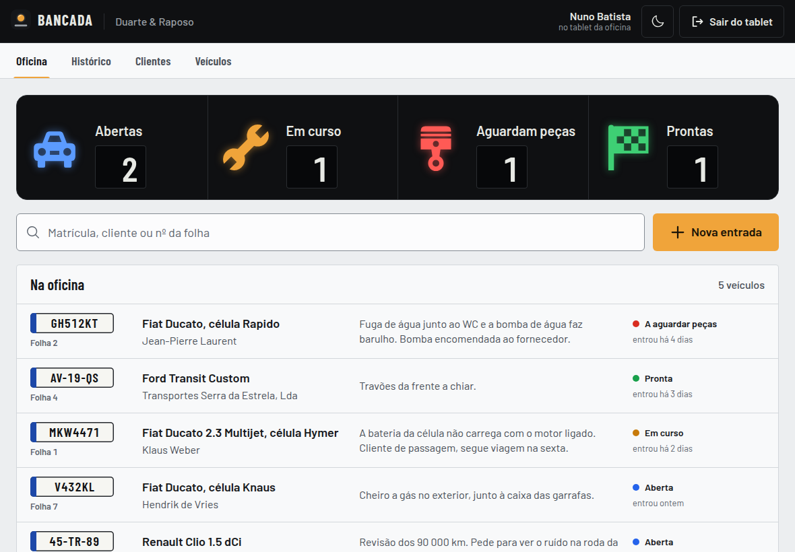
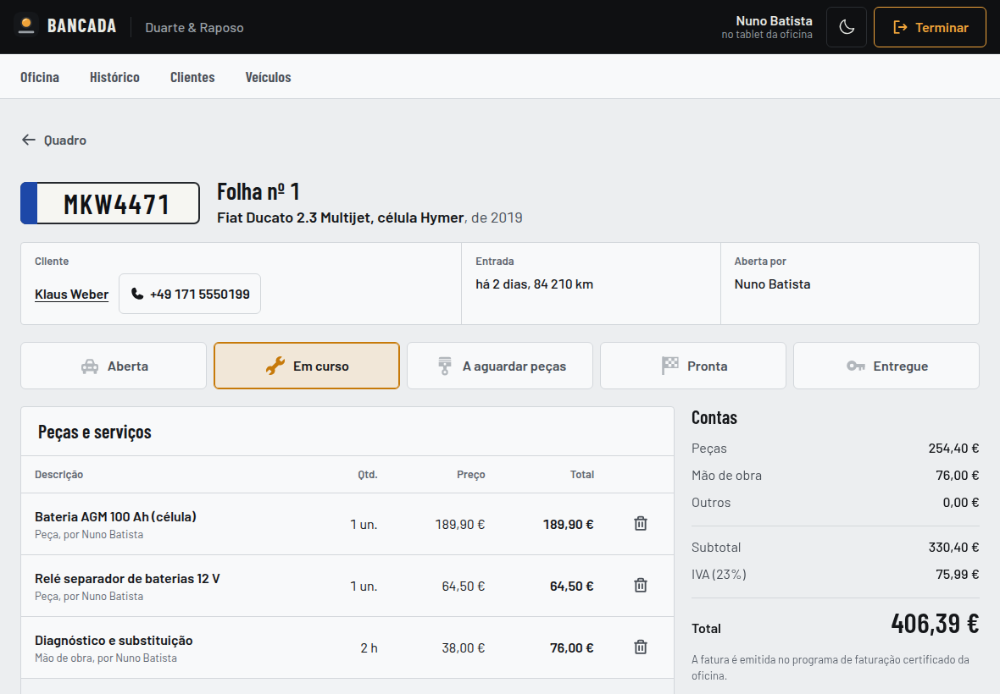
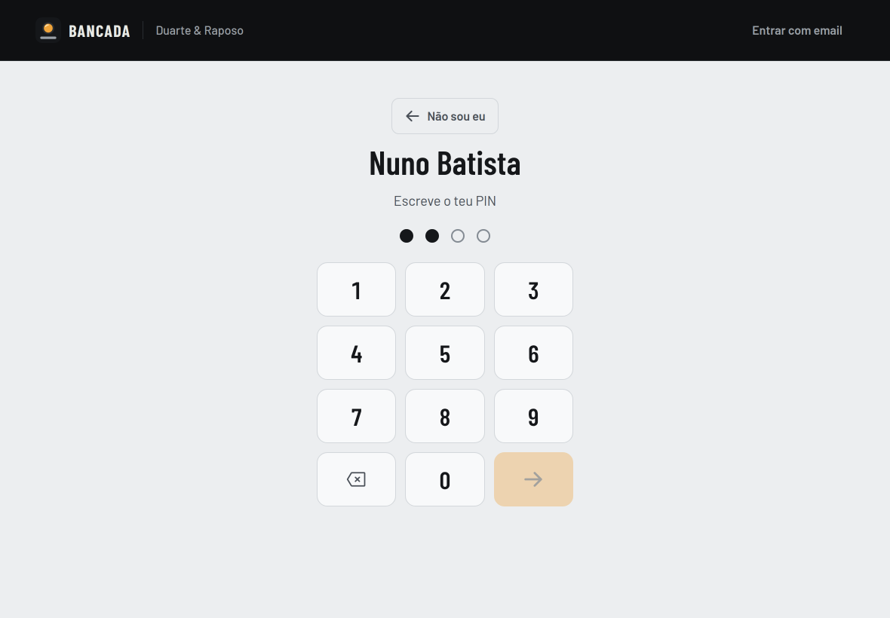

<p align="center">
  
</p>

<h1 align="center">Bancada</h1>

<p align="center">
  <strong>Folhas de obra digitais para oficinas.</strong><br>
  <em>Licenciatura em Informática Web, Móvel e na Nuvem · Universidade da Beira Interior</em>
</p>

<p align="center">
  
  <a href="https://github.com/TiagoPereira001/Projeto_final_UBI/actions/workflows/ci.yml?query=branch%3Adev"></a>
  
  
  
</p>

<p align="center">
  
</p>

## O que é

A Bancada substitui as folhas de obra em papel das oficinas. Cada entrada de um veículo passa a ser uma folha digital. Os mecânicos registam as peças e as horas à medida que trabalham, e o gestor vê o que está na oficina, em que estado, quanto vale o trabalho e quem o fez.

O projeto nasceu na oficina **Duarte & Raposo** (Canhoso, Covilhã), especializada em mecânica, eletricidade e autocaravanas, onde as folhas de papel se perdiam, se sujavam e obrigavam a fazer as contas à mão. Começou como um sistema só para essa oficina e passou a servir **qualquer oficina**: cada uma regista-se sozinha e só vê os seus dados. A Duarte & Raposo é o primeiro cliente.

A descrição completa do produto (utilizadores, percurso de um carro pela oficina, o que existe e o que ainda não existe) está no [`PRODUCT.md`](PRODUCT.md).

## Funcionalidades

- **Quadro da oficina** com um "tablier": uma luz por estado (abertas, em curso, a aguardar peças, prontas), acesa quando há veículos nesse estado, como as luzes do painel de um carro. Tocar numa luz filtra a lista.
- **Tablet partilhado (modo bancada):** o tablet fica na oficina e cada mecânico entra com o seu nome e PIN. O que regista fica em nome dele, e a sessão termina sozinha se o tablet ficar parado.
- **Nova entrada** a partir da matrícula. Se o veículo já cá esteve, aparece logo; se for novo, regista-se o veículo e o dono no mesmo passo.
- **Folha de obra:**
  - estado da reparação, escolhido com um toque;
  - peças, mão de obra (em horas) e outros custos, com os totais e o IVA calculados ao cêntimo;
  - observações e conselhos para o cliente (manutenção preventiva);
  - uma folha entregue fica fechada.
- **Autocaravanas:** além da marca e do modelo do chassis, guarda-se a marca da célula habitacional.
- **Gestão:**
  - histórico de folhas;
  - clientes, incluindo estrangeiros;
  - veículos, com o histórico de visitas;
  - equipa (PIN e/ou email);
  - definições da oficina (dados, taxa de IVA e tablets).
- **Registo público** de oficinas novas.
- **Temas claro e escuro.** Pensada para tablet (alvos de toque grandes), funciona também no computador e no telemóvel. É uma PWA: pode ser instalada no ecrã inicial.

A Bancada **não emite faturas**: em Portugal, isso exige software certificado pela Autoridade Tributária. Calcula os totais e o IVA; a fatura é emitida no programa de faturação da oficina.

<p align="center">
  
  
</p>

## Estado do projeto

**Feito:**
- API multi-oficina com sessões seguras e modo bancada;
- base de dados com o isolamento entre oficinas garantido também pelas chaves estrangeiras;
- interface completa para tablet, computador e telemóvel;
- 52 testes automáticos contra um SQL Server real;
- integração contínua no GitHub;
- documentação e relatório.

**Ainda não feito:**
- instalação na oficina e testes com os mecânicos;
- versão online com HTTPS;
- migrações da base de dados e cópias de segurança;
- integração com programas de faturação.

A lista completa está no [`docs/analise.md`](docs/analise.md).

## Stack

| Parte | Tecnologia |
|---|---|
| Frontend | React 19 + Vite 8, React Router 7, PWA (vite-plugin-pwa), CSS próprio com tokens, fontes Barlow self-hosted |
| Backend | Node.js 22, Express 5, JWT em cookies httpOnly, bcrypt, helmet, express-rate-limit |
| Base de dados | SQL Server 2022 (Docker), modelo relacional normalizado |
| Qualidade | 52 testes com `node:test` contra SQL Server real, GitHub Actions, oxlint, GitGuardian |
| Infraestrutura | Docker Compose; imagem única com a API a servir o frontend (mesma origem) |

## Segurança

- **Isolamento entre oficinas** em três sítios:
  - na API: todas as consultas filtram pela oficina da sessão;
  - na base de dados: chaves estrangeiras compostas;
  - nos testes automáticos.
- **Sessão:** fica num cookie `httpOnly` com `SameSite=Strict`. Há verificação de origem contra CSRF e uma `Content-Security-Policy` rigorosa.
- **Autoria:** a autoria das folhas e das linhas vem sempre da sessão. Desativar uma conta ou mudar a password corta as sessões na hora.
- **Login e passwords:**
  - passwords com bcrypt (custo 12);
  - login com tempo constante;
  - limite de tentativas por conta e por IP;
  - PIN bloqueado após 5 falhas.
- **Base de dados:** a API usa um login só de dados, sem permissão para apagar clientes, veículos, colaboradores nem folhas. O soft delete é garantido pela própria base de dados.
- **Segredos:** só no `.env`, nunca no código. O SQL Server só é acessível a partir da própria máquina.

A análise completa (o que foi encontrado, o risco e o que mudou) está em [`docs/analise.md`](docs/analise.md).

## Base de dados

Seis tabelas: `Oficina`, `Colaborador`, `Cliente`, `Veiculo`, `Folha_Obra` e `Linha_Reparacao`. O esquema está em [`backend/database/schema.sql`](backend/database/schema.sql), com comentários a explicar cada decisão, e o diagrama no anexo do relatório.

## Como executar

Requisitos: Docker e Node.js 22 ou mais recente.

```bash
# 1. configuração: copiar o modelo e preencher as passwords e o JWT_SECRET
cp .env.example .env

# 2. base de dados (SQL Server em Docker, só acessível em 127.0.0.1)
docker compose up -d

# 3. API: preparar a BD e carregar a Duarte & Raposo com dados de demonstração
cd backend
npm install
npm run db:setup
npm run db:seed        # mostra a password do gestor e os PINs dos mecânicos
npm run dev            # http://localhost:3000

# 4. frontend (noutro terminal)
cd frontend
npm install
npm run dev            # http://localhost:5173
```

> **Mac com Apple Silicon:** o SQL Server não tem imagem ARM. O `docker-compose.yml` já usa `platform: linux/amd64` (emulação), e o primeiro arranque demora um pouco mais.

**Tudo em containers** (a API serve o frontend compilado): `docker compose --profile app up -d --build` e abrir http://localhost:3000.

**Testes** (precisam do SQL Server a correr): `cd backend && npm test`. Usam uma base de dados própria (`Bancada_Teste`), nunca a de desenvolvimento.

Os dados criados pelo `npm run db:seed` (clientes, veículos, matrículas, folhas) são **fictícios**.

## Documentação

| Ficheiro | Para quê |
|---|---|
| [`PRODUCT.md`](PRODUCT.md) | o produto: utilizadores, problema, funcionalidades, o que ainda não existe |
| [`DESIGN.md`](DESIGN.md) | o sistema visual: cores, tipografia, componentes e regras |
| [`AI.md`](AI.md) | mapa do código para agentes de IA (e pessoas): regras que não se podem partir, API, comandos |
| [`CLAUDE.md`](CLAUDE.md) | memória do projeto para o Claude Code: decisões tomadas, preferências, estado atual |
| [`docs/analise.md`](docs/analise.md) | análise de segurança, desempenho e viabilidade |
| [`Relatorio/`](Relatorio/) | relatório do projeto e documento das ferramentas usadas (e porquê), em LaTeX, com os PDF compilados |

## Fluxo de trabalho

- **Ramos:** `main` é a versão estável, `dev` é a integração, e cada tarefa tem o seu ramo, que entra no `dev` por pull request.
- **CI:** em cada pull request, o GitHub Actions corre os testes da API contra um SQL Server e o lint + build do frontend, e a GitGuardian procura segredos. Um PR só entra com tudo verde.
- **Antes de enviar:** `npm test` no backend e `npm run lint && npm run build` no frontend.

## Estrutura

```text
.
├── backend/            API REST (rotas, middleware, validação, scripts da BD, testes)
├── frontend/           React + Vite (PWA): páginas, componentes, estilos
├── docs/               análise de segurança, desempenho e viabilidade; imagens
├── Relatorio/          relatório e documento das ferramentas, em LaTeX, e anexos
├── .github/workflows/  integração contínua
├── PRODUCT.md          o produto
├── DESIGN.md           sistema visual
├── AI.md               mapa do projeto para agentes de IA
├── CLAUDE.md           memória do projeto para o Claude Code
├── AGENTS.md           ponto de entrada para outros agentes (aponta para o AI.md)
├── docker-compose.yml
└── Dockerfile
```

## Autor

**Tiago Dias Pereira** (nº 55019)
Projeto da UC de Projeto de Software Web, Móvel e na Nuvem, licenciatura em Informática Web, Móvel e na Nuvem, **Universidade da Beira Interior**, Covilhã.
