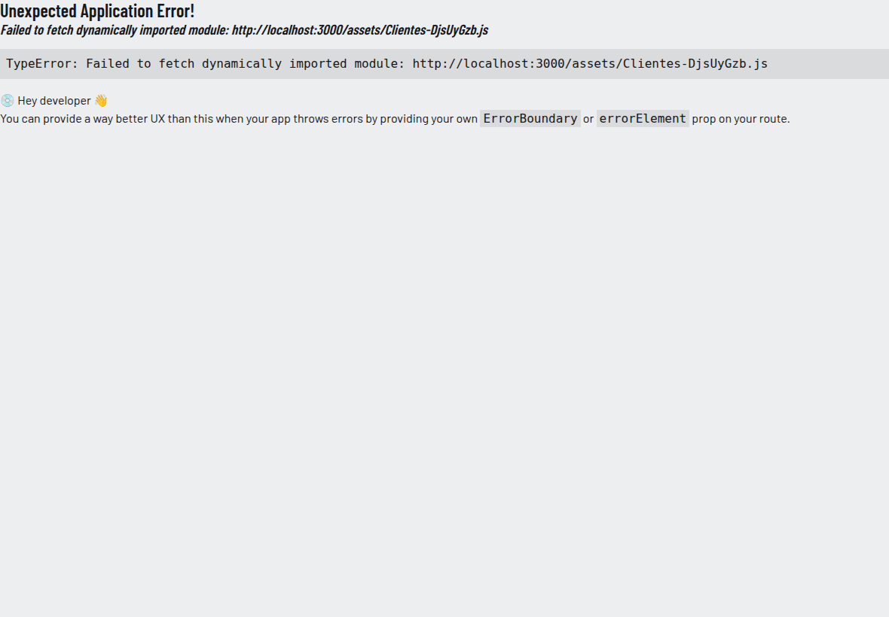
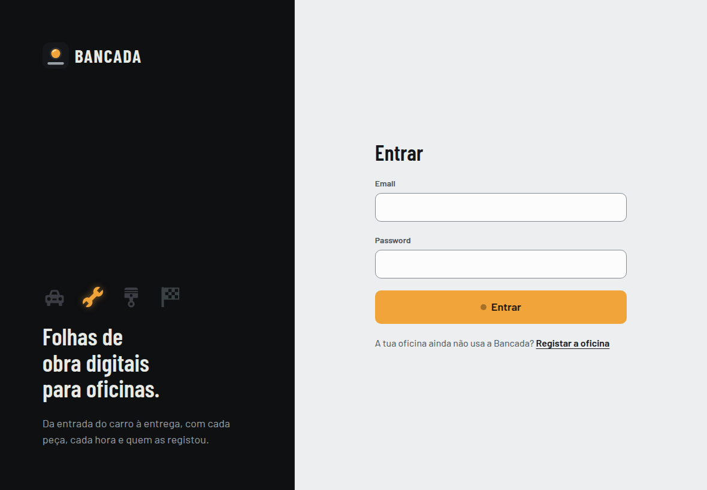

# Auditoria de qualidade, segurança e desempenho

**Bancada**, versão do ramo `dev` no commit `7856129` · 27 de setembro de 2026

Esta auditoria foi feita pelo Claude Code (assistente de programação com IA), a pedido do autor, seguindo dois guiões que ele forneceu:
- um de auditoria técnica completa (funcionalidade, API, dados, segurança, desempenho, acessibilidade, fiabilidade e automação);
- um de mentoria (explicar o porquê de cada problema e como o reconhecer).

Tudo o que aqui aparece como resultado foi **medido**. O que não foi possível medir está marcado como **NÃO VERIFICADO**, com o teste exato que falta fazer. Os scripts usados estão em [`docs/auditoria/scripts/`](auditoria/scripts/), prontos a repetir.

> **Atualizada a 28 de setembro de 2026.** O autor voltou a enviar o mesmo guião depois de a interface ter sido redesenhada e de entrar o lançador para o Mac. Os testes todos foram repetidos sobre a versão nova: os resultados, quatro achados novos (já corrigidos) e um por corrigir estão na [secção 14](#14-reauditoria-de-28092026).

## Como ler este documento

1. O [resumo](#2-resumo) diz o essencial em meia página.
2. Os [achados](#4-achados) têm o formato pedido: severidade, evidência, impacto, recomendação e como validar a correção. Os principais trazem também uma caixa **Para aprender**: o conceito por trás, porque acontece e como o reconhecer noutro projeto.
3. As secções 5 a 9 têm os números (desempenho, acessibilidade, fiabilidade, automação).
4. A secção [13](#13-para-aprenderes-com-esta-auditoria) tem exercícios para fazeres sozinho e as perguntas que um júri pode fazer.
5. A secção [14](#14-reauditoria-de-28092026) é a reauditoria de 28/09: o que mudou desde a primeira e o estado de cada achado.

Cada achado diz também de que **tipo** é, porque não são todos iguais:
- **bug**: o comportamento está errado;
- **code smell**: funciona, mas escala ou mantém-se mal;
- **decisão de desenho**: uma escolha válida, com custos;
- **preferência**: uma convenção, não um erro.

---

## 1. Âmbito

| | |
|---|---|
| **Dentro** | Instância local num container: a API em modo produção (`NODE_ENV=production`) a servir o frontend compilado, SQL Server 2022 em Docker, dados fictícios (`db:seed`, duas oficinas de teste e uma oficina de carga). Código-fonte, CI e dependências. |
| **Fora** | Infraestrutura do GitHub, serviços de terceiros, a rede e os dispositivos da Duarte & Raposo. Não existe nenhuma instalação online. |
| **Desconhecido** | Onde vai ser alojada (HTTPS, proxy), o modelo exato do tablet, a qualidade do Wi-Fi da oficina, quantas oficinas vão partilhar o servidor. |
| **Autorização** | Projeto do próprio autor, instância isolada, dados fictícios. Os testes de carga e de falhas foram feitos só nessa instância. |

**Ferramentas:**
- Node.js 22.22.2 (scripts com `fetch` e cookies);
- Playwright 1.63.0 com Chromium 141;
- axe-core 4.13.0 e Lighthouse 12.8.2;
- `sqlcmd` (estatísticas de leitura do SQL Server);
- `npm audit`, e o `node --test` com cobertura.

**A máquina**: um container com 4 CPUs, com a API e o SQL Server na mesma máquina.

## 2. Resumo

**Não há problemas críticos nem altos.** As bases de segurança estão sólidas, e com evidência:
- nenhuma oficina consegue ler, alterar ou adivinhar dados de outra (I01 a I06);
- as sessões resistem a tokens adulterados e sem assinatura;
- CSRF, XSS e injeção de SQL foram tentados e falharam;
- o `npm audit` dá zero vulnerabilidades conhecidas;
- o axe não encontrou nenhuma violação em 13 ecrãs, nos dois temas.

**O que vale a pena corrigir primeiro** (por ordem):

1. **Erros inesperados na interface mostram um ecrã técnico em inglês** ("Unexpected Application Error! ... Hey developer 👋"), sem forma de voltar. Falta um `errorElement` no router ([REL-001](#rel-001)).
2. **Sem rede, o tablet parece ter perdido a sessão.** Ao abrir a app sem ligação, aparece o ecrã de entrada em vez de "sem ligação" ([REL-003](#rel-003)). No modo bancada, o tablet parece desligado.
3. **Duas consultas pesam com muitos dados.** O histórico soma as linhas de todas as folhas antes de escolher a página (204 ms em vez de 33 ms com 12 000 folhas). O quadro não usa o índice por causa do filtro em JSON (60 ms de CPU em vez de 2 a 4 ms). Ver [PERF-001](#perf-001) e [PERF-002](#perf-002).
4. **O frontend não tem testes automáticos no repositório** ([AUT-001](#aut-001)). Os percursos no browser desta auditoria podem ser o ponto de partida.

O resto são achados baixos ou informativos: validação de números demasiado permissiva, logout que não invalida o token, enumeração de emails, três alvos de toque abaixo dos 48 px do projeto.

**Números principais:**
- **Testes executados**: 82 verificações no plano da secção 3:
  - 69 passam;
  - 9 são observações;
  - 4 revelaram problemas.
- **Cobertura do backend** (medida): 93% das linhas e 82% dos ramos.
- **Com 5 anos de dados fictícios** (12 000 folhas, 72 000 linhas):
  - um pedido isolado ao quadro demora 117 ms, e ao histórico 247 ms;
  - com 10 pedidos em simultâneo, abrir uma folha demora 55 ms (p50).

## 3. Plano de testes e resultados

Legenda: ✅ passa · ⚠️ observação (funciona como foi desenhado, mas há algo a saber) · ❌ problema.

### 3.1 Autenticação e sessões

| ID | Teste | Esperado | Obtido | |
|---|---|---|---|---|
| A01 | Login do gestor e opções do cookie | 200, `HttpOnly`, `SameSite=Strict`, `Path=/api` | 200, as três opções, `Max-Age=43200` (sem `Secure` porque a instância corre em `http://localhost`) | ✅ |
| A02 | Password errada vs email inexistente | a mesma resposta | 401 "Email ou password incorretos." nos dois | ✅ |
| A03 | Tempo de resposta dos dois casos (mediana de 3) | semelhante | 264 ms vs 264 ms | ✅ |
| A04 | Pedido sem sessão | 401 em JSON | 401 `{"erro":"A tua sessão terminou. Entra outra vez."}` | ✅ |
| A05 | Token com assinatura adulterada / com `alg: none` | 401 / 401 | 401 / 401 | ✅ |
| A06 | Duração e audiência do token | 12 h, `aud=sessao` | 43 200 s, `aud=sessao`, `iss=bancada` | ✅ |
| A07 | Token copiado antes de "sair", usado depois | 401 (ideal) | 200: continua válido | ⚠️ [SEC-001](#sec-001) |
| A08 | `GET /auth/sessao` sem cookie | 200 com `colaborador: null` | como esperado | ✅ |
| A09 | Token do dispositivo usado como sessão | 401 | 401 | ✅ |
| A10 | Gestor muda as próprias credenciais | continua com sessão | sessão renovada | ✅ |
| A11 | Gestor muda o PIN de um mecânico com sessão aberta | a sessão aberta passa a 401 | 200 antes, 401 depois | ✅ |
| A12 | Gestor desativa um colaborador com sessão aberta | 401 depois | 200 antes, 401 depois | ✅ |
| L01 | 9 logins falhados para o mesmo email | 8 × 401, depois 429; outro email continua | exatamente isso | ✅ |
| P01 | PIN errado 5 vezes, depois o PIN certo | 401 × 4, 429, 429 | 401 × 4, 429, 429 "PIN bloqueado... daqui a 6 min" | ✅ |
| P02 | PIN para um colaborador que não existe | 401 "PIN incorreto." | igual | ✅ |
| S01 | Tablet parado 4 min 30 s, depois 5 min 15 s | continua; depois volta a "quem vai trabalhar" | continua aos 4:30; aos 5:15 volta ao ecrã da bancada e a sessão acaba | ✅ |

### 3.2 Modo bancada e autorização

| ID | Teste | Esperado | Obtido | |
|---|---|---|---|---|
| B01 | Gestor transforma o dispositivo em bancada | 204, cookie do dispositivo, sessão termina | como esperado | ✅ |
| B02 | Lista "quem vai trabalhar" | só id, nome e cargo | só id, nome e cargo | ✅ |
| B03 | Mecânico entra com nome e PIN | 200, `via: pin` | como esperado | ✅ |
| B04 | Rotas da bancada sem cookie de dispositivo | 401 / 401 | 401 / 401 | ✅ |
| B05 | "Desligar todos os tablets" e usar o cookie antigo | 401 | 401 | ✅ |
| R01 | Mecânico: resumo, equipa, definições, arquivar cliente | 403 em tudo | 403 em tudo | ✅ |
| R02 | Gestor que entrou com PIN: gerir equipa / ver resumo | 403 / 200 | 403 / 200 | ✅ |
| R03 | Folha entregue: mecânico reabre, edita, junta linha; gestor reabre | 409, 409, 409, 200 | igual | ✅ |
| F01 | Reabrir limpa a data de entrega | `dataEntrega: null` | `null` | ✅ |

### 3.3 Isolamento entre oficinas

| ID | Teste | Esperado | Obtido | |
|---|---|---|---|---|
| I01 | Registo público de uma segunda oficina (B) | 201 e sessão | como esperado | ✅ |
| I02 | B lê cliente, veículo e folha de A pelo id | 404 × 3 | 404 × 3 | ✅ |
| I03 | B altera, arquiva, junta linha, apaga linha em A | 404 × 5 | 404 × 5 | ✅ |
| I04 | B usa ids de A no corpo (folha, veículo) | 400, 400, 404 | 400, 400, 404 | ✅ |
| I05 | Listas de B | só dados de B | 1 cliente, 0 veículos, 0 folhas | ✅ |
| I06 | B percorre os ids de folha 1 a 60 | só 404 | 60 × 404 | ✅ |
| I07 | Registo com o email de um gestor que já existe | | 409 "Já existe uma conta com esse email." | ⚠️ [SEC-002](#sec-002) |
| I08 | B cria colaborador com o email de um gestor de A | | 409, o mesmo aviso | ⚠️ [SEC-002](#sec-002) |

### 3.4 Validação, casos-limite e erros

| ID | Teste | Esperado | Obtido | |
|---|---|---|---|---|
| V01 | Cliente sem campos | 400 com `nome` e `telefone` | igual | ✅ |
| V02 | NIF com dígito errado / válido / repetido / alemão | 400 / 201 / 409 / 201 | igual | ✅ |
| V03 | Nome com acentos, emoji, `<b>`, `\u0007` e `​` | texto guardado sem o `\u0007` | guardado; o espaço invisível `​` fica | ✅ ([SEC-008](#sec-008)) |
| V04 | Nome com 121 caracteres / telefone "liga-me" | 400 / 400 | 400 / 400 | ✅ |
| V05 | Matrícula em minúsculas, repetida com espaços, 1 carácter; ano 1899 e ano atual + 2; tipo inválido | 201 normalizada, 409, 400 × 4 | igual | ✅ |
| V06 | Marca da célula num ligeiro | ignorada | `null` | ✅ |
| V07 | Linhas: 0, −1, "0,5", 3 casas, 100 000, preço 0, 10 milhões, "1e2", categoria inválida, 151 car., " 1 000 ", 0.1+0.2 | 400 400 201 400 400 201 400 400 400 400 201 400 | igual | ✅ |
| V08 | Quilómetros "0x10" e "1e3" | 400 (ideal) | aceites como 16 e 1000 | ⚠️ [SEC-003](#sec-003) |
| V09 | `veiculoId` enviado como lista `[id]` | 400 (ideal) | 201: folha criada | ⚠️ [SEC-003](#sec-003) |
| V10 | Data de entrada amanhã / em 1999 / "31/12/2025" | 400 × 3 | 400 × 3 | ✅ |
| V11 | JSON mal formado / corpo de 150 KB / texto simples | 400 / 413 / 400 | igual, com mensagens em português | ✅ |
| V12 | Rota inexistente, método errado, id "abc", enorme, negativo | 404 em JSON | 404 em JSON (um método errado dá 404 e não 405) | ✅ ([QA-002](#qa-002)) |
| V13 | Id da folha escrito em hexadecimal (`/folhas-obra/0x9`) | 404 (ideal) | 200: abre a folha 9 | ⚠️ [SEC-003](#sec-003) |
| V14 | Paginação: `porPagina=100000`, `pagina=-3`, texto | limitada | 200 por página, página 1, valores por omissão | ✅ |
| V15 | Pesquisa com `%`, `_`, `[a-z]`, `' OR 1=1 --` | nenhuma devolve tudo | 0 resultados em todas | ✅ |
| V16 | Pesquisa com `1; DROP TABLE Folha_Obra;--` | 200, sem efeitos | 200, tabela intacta | ✅ |

### 3.5 Concorrência e contas

| ID | Teste | Esperado | Obtido | |
|---|---|---|---|---|
| D01 | 10 entradas em simultâneo para o mesmo veículo | 1 × 201, 9 × 409, contador +1 | exatamente isso | ✅ |
| D02 | 15 entradas em simultâneo, 15 veículos | números seguidos, sem repetições | 12 a 26, seguidos | ✅ |
| D03 | 20 linhas em simultâneo na mesma folha | 20 × 201, subtotal 22,00 | igual | ✅ |
| M01 | 3 × 19,99 + 2,5 h × 35 + 0,10, IVA 23% | 147,57 + 33,94 = 181,51 | igual | ✅ |
| M02 | Tipo dos valores no JSON | número com 2 casas no máximo | `181.51` | ✅ |
| M03 | Arredondamento de 1,5 × 0,03 = 0,045 | 0,05 (o `ROUND` do SQL Server afasta do zero) | 0,05 | ✅ |
| M04 | Mudar o IVA da oficina para 6% | folha antiga fica com 23, nova com 6 | igual | ✅ |
| M05 | Entregues em setembro, hora de Lisboa (00:30 de 1/9 conta, 23:30 de 31/8 não) | 1 folha, 123,00 € | igual | ✅ |
| M06 | O mesmo resumo sem o parâmetro `desde` | início do mês em Lisboa | início do mês em UTC: perde a entrega das 00:30 | ⚠️ [QA-001](#qa-001) |

### 3.6 Segurança do browser e do servidor

| ID | Teste | Esperado | Obtido | |
|---|---|---|---|---|
| C01 | POST com `Origin` e `Sec-Fetch-Site` de outro site | 403 × 3 | 403 × 3 | ✅ |
| C02 | POST sem `Origin` nem `Sec-Fetch-Site` (não é um browser) | aceite | 201 | ⚠️ decisão de desenho: um browser envia sempre um dos dois, e o cookie é `SameSite=Strict` |
| X01 | HTML e JavaScript guardados em nome, marca, notas e linha | nada executa, nada é criado | nada executa, 0 elementos criados, texto mostrado tal como foi escrito, no quadro, na folha e no cliente | ✅ |
| H01 | Cabeçalhos da página e da API | CSP rigorosa, `nosniff`, sem `X-Powered-By` | CSP `default-src 'self'` sem `unsafe-inline`, `frame-ancestors 'none'`, COOP e CORP `same-origin`, `Referrer-Policy: no-referrer`, `nosniff`, sem `X-Powered-By`, API com `Cache-Control: no-store` | ✅ ([SEC-005](#sec-005)) |
| H02 | Path traversal e ficheiros sensíveis (`/../../etc/passwd`, `%2e%2e`, `/.env`, `/.git/config`, `/backend/config.js`) | nenhuma fuga | nenhuma fuga: todos devolvem a página da app | ✅ |
| H03 | Pedido de outro site (CORS) | sem `Access-Control-Allow-Origin` | nenhum cabeçalho CORS | ✅ |
| H04 | Segredos no bundle, mapas de código, `localStorage` | nada sensível | 0 mapas de código; "password" só em nomes de campos; `localStorage` só guarda o tema | ✅ |
| H05 | Segredos no repositório | nenhum | `.env` fora do git, `.env.example` vazio | ✅ |
| H06 | Dependências (`npm audit`, `npm outdated`) | sem vulnerabilidades | 0 vulnerabilidades (API: 168 dependências; frontend: 10 de produção, 409 de desenvolvimento), nenhuma desatualizada | ✅ |
| H07 | Service worker | nunca guarda respostas da API | só guarda a app; `/api/` excluído | ✅ |

### 3.7 Fiabilidade

| ID | Teste | Esperado | Obtido | |
|---|---|---|---|---|
| E01 | SQL Server parado: saúde, leitura, escrita, página | 503, erro genérico, erro genérico, 200 | 503 (6 ms), 500 genérico (6 ms), 500 (4 ms), 200; nenhum detalhe interno | ✅ |
| E02 | Mensagem com a base de dados em baixo | "temporário" | 500 "Erro interno do servidor. Tenta outra vez daqui a pouco." | ⚠️ [REL-004](#rel-004) |
| E03 | SQL Server volta: a API recupera sozinha? | sim, sem reiniciar | saúde 200 ao fim de 8 s, leitura 200 | ✅ |
| L02 | Rajada de pedidos do mesmo IP | 429 perto do pedido 1000 | 429 no pedido ~979, `Retry-After: 282` | ✅ |
| O01 | Abrir a app sem rede (PWA) | a app abre e diz que não há ligação | a app abre da cache, mas mostra o **ecrã de entrada**, sem falar da ligação | ❌ [REL-003](#rel-003) |
| E04 | Ficheiro de uma página que deixou de existir (depois de uma atualização) | mensagem clara | servidor devolve 200 com HTML; a app mostra o ecrã de erro técnico do React Router | ❌ [REL-001](#rel-001), [REL-002](#rel-002) |
| N01 | Numeração depois de reiniciar o SQL Server | sem saltos visíveis | ids internos saltaram de cerca de 40 para mais de 1000; números das folhas 1 a 34, sem saltos | ✅ (ver [pontos fortes](#pontos-fortes)) |

### 3.8 Interface: acessibilidade e ecrãs

| ID | Teste | Esperado | Obtido | |
|---|---|---|---|---|
| A11Y1 | axe (WCAG 2.0, 2.1 e 2.2, A e AA) em 13 ecrãs, temas claro e escuro | 0 violações | 0 violações | ✅ |
| A11Y2 | axe no ecrã do PIN | 0 | 0 | ✅ |
| K01 | Teclado no ecrã de entrada | ordem lógica, foco visível | email → password → Entrar → Registar, foco sempre visível | ✅ |
| T02 | Teclas do PIN | ≥ 72 px | 72 px (12 teclas) | ✅ |
| T01, T03 | Alvos de toque no tablet | ≥ 48 px (regra do projeto) | logótipo 122 × **36**, nome do cliente na folha 151 × **24**, remover linha **46** × 48 | ❌ [A11Y-001](#a11y-001) |
| RSP1 | Transbordo horizontal em 390, 820, 1180 e 1440 px, 12 ecrãs | nenhum | só num caso: nome com mais de ~35 caracteres seguidos, +12 px a 390 px | ❌ [QA-003](#qa-003) (menor) |
| CON1 | Erros na consola e violações da CSP em todo o percurso | nenhum | nenhum | ✅ |

---

## 4. Achados

Formato de cada achado: **severidade** (técnica: crítica, alta, média, baixa, info), **tipo**, **local**, e a **natureza** da evidência:
- **confirmado**: reproduzido;
- **risco potencial**: só por análise do código;
- **preventivo**: recomendação.

A prioridade de correção está na [secção 10](#10-prioridades-de-correção). Todos os achados estão **ABERTOS**: esta auditoria não mudou código.

### REL-001
**Qualquer erro inesperado na interface mostra o ecrã de erro por omissão do React Router**

| | |
|---|---|
| Severidade | MÉDIA · bug (falta tratamento de erros) · confirmado |
| Local | `frontend/src/App.jsx`: o `createBrowserRouter` não tem `errorElement` em nenhuma rota |
| Descrição | Quando um componente lança um erro durante o desenho, ou uma página carregada à parte não consegue ser importada, o React Router mostra o seu ecrã por omissão. Esse ecrã está em inglês, é para programadores e não tem botão para voltar. |
| Evidência | Teste E04 (`chunk.mjs`), captura em baixo: "Unexpected Application Error! Failed to fetch dynamically imported module... 💿 Hey developer 👋 You can provide a way better UX than this..." |
| Impacto | Um mecânico no tablet fica preso num ecrã que não percebe; só sai recarregando a página. |
| Recomendação | Um `errorElement` na rota de topo (e, se fizer sentido, nas filhas) com: uma frase em português, um botão "Recarregar" e um botão "Voltar ao quadro". Se o erro for "Failed to fetch dynamically imported module", recarregar sozinho uma vez (é quase sempre uma versão nova no servidor). |
| Validação | Correr `chunk.mjs`: o ecrã deve ser o novo. Forçar um `throw` num componente em desenvolvimento e confirmar o mesmo. |



> **Para aprender: fronteiras de erro.**
> Em React, um erro durante o desenho de um componente desmonta a árvore toda. Só uma **fronteira de erro** (`ErrorBoundary`, ou o `errorElement` do React Router) o apanha e mostra outra coisa no lugar.
> - **Porque aconteceu aqui**: tudo funcionou nos testes, por isso nunca apareceu. É o tipo de falha que só se vê quando algo inesperado acontece.
> - **Como reconhecer**: procura, em qualquer app React, onde está a fronteira de erro. Se a resposta for "em lado nenhum", qualquer `undefined.x` numa página deita a app inteira abaixo.
> - Este conceito vais encontrá-lo em todos os projetos de frontend. Vale a pena perceberes bem como funciona, sem depender de uma IA para o explicar.

### REL-002
**O servidor responde 200 com a página da app a pedidos de ficheiros que não existem em `/assets/`**

| | |
|---|---|
| Severidade | BAIXA · bug de configuração · confirmado |
| Local | `backend/app.js`, `servirFrontend()`: o `app.get(/^(?!\/api\/).*/)` devolve o `index.html` a qualquer `GET` |
| Descrição | `GET /assets/Clientes-versao-antiga.js` responde `200 text/html`. O browser recusa executar HTML como JavaScript. |
| Evidência | Teste H02 e `chunk.mjs`: "servidor para um asset inexistente: 200 text/html". |
| Impacto | Com [REL-001](#rel-001), é assim que uma atualização pode partir a app a quem a tem aberta. A probabilidade é baixa: a app descarrega as páginas de gestão nos primeiros segundos (`requestIdleCallback` no `App.jsx`), e o service worker guarda os ficheiros da versão que tem. O resultado, quando acontece, é o ecrã da captura acima. |
| Recomendação | O `index.html` só para navegação: caminhos sem extensão, ou pedidos com `Accept: text/html`. Tudo o que estiver em `/assets/` e não existir deve dar 404. |
| Validação | `curl -i http://localhost:3000/assets/nao-existe.js` deve dar 404; `curl -i http://localhost:3000/folhas/12` deve continuar a dar a página. |

> **Para aprender: o "fallback" de uma SPA.** Numa aplicação de página única, `/folhas/12` não é um ficheiro: é uma rota do React, e o servidor tem de devolver o `index.html`. Mas essa regra só serve para **navegação**. Se for aplicada a tudo, um ficheiro que falta passa a "existir" com o conteúdo errado, e o erro aparece longe da causa. **Como reconhecer**: pede ao servidor um ficheiro que não existe (`/assets/x.js`, `/favicon-velho.ico`). Se a resposta for 200, a regra está larga demais.

### REL-003
**Sem rede ao abrir, a app mostra o ecrã de entrada em vez de dizer que não há ligação**

| | |
|---|---|
| Severidade | MÉDIA · bug · confirmado |
| Local | `frontend/src/context/SessaoContext.jsx`, `atualizar()`: `catch { setSessao(VAZIA) }` |
| Descrição | Ao arrancar, a app pede `/api/auth/sessao`. Se o pedido falhar por falta de rede, o `catch` trata isso como "não há sessão" e a app manda para `/entrar`. No modo bancada, o tablet também "esquece" que é bancada. Os cookies continuam válidos: quando a rede voltar, recarregar resolve. |
| Evidência | Teste O01 (`auditoria-browser.mjs`), captura em baixo: com a rede cortada, a app abre a partir da cache e mostra "Entrar Email Password Entrar", sem nenhuma menção à ligação. |
| Impacto | Num tablet partilhado com Wi-Fi instável, parece que a sessão acabou ou que o tablet foi desligado da bancada. Isso gera chamadas ao gestor e tentativas de login que falham. |
| Recomendação | Distinguir o erro de rede (o `ErroApi` com `status 0`, que o `api.js` já cria) do 401. Com erro de rede: um ecrã "Sem ligação ao servidor", com "Tentar outra vez", e uma nova tentativa automática quando o browser dispara o evento `online`. |
| Validação | Correr o teste O01: deve mostrar a mensagem de ligação e não o formulário. Repetir no modo bancada. |



> **Para aprender: um `catch` que apanha tudo.** `catch { estado = vazio }` junta num só caso erros muito diferentes: "não tens sessão" (401), "o servidor falhou" (500) e "não há rede" (sem resposta). Cada um pede uma reação diferente. **Como reconhecer**: sempre que vires um `catch` sem olhar para o erro, pergunta "que erros podem chegar aqui, e devem todos dar o mesmo resultado?". Chama-se a isto uma **taxonomia de erros**, e é das coisas que mais separam código de principiante de código sénior.

### REL-004
**Base de dados em baixo: a API responde 500 e não 503**

| | |
|---|---|
| Severidade | INFO · preferência/convenção · confirmado (E01, E02) |
| Local | `backend/middleware/erros.js` |
| Descrição e recomendação | Os erros de ligação ao SQL Server (`ESOCKET`, `ELOGIN`, `ETIMEOUT` do `mssql`) caem no 500 genérico. Um 503 com "Serviço temporariamente indisponível" diz melhor o que se passa, e o frontend pode usá-lo para tentar outra vez sozinho. A saúde (`/api/saude`) já responde 503, e bem. |

### PERF-001
**O histórico soma as linhas de todas as folhas antes de escolher as 50 da página**

| | |
|---|---|
| Severidade | BAIXA hoje, sobe com os dados · code smell · confirmado |
| Local | `backend/routes/folhasObra.js`, `GET /api/folhas-obra` (histórico e pesquisa) |
| Descrição | O `OUTER APPLY` que soma as linhas e o `COUNT(*) OVER ()` são calculados para todas as folhas que passam o filtro; só depois o `OFFSET ... FETCH` escolhe a página. |
| Evidência | Oficina de carga com 12 000 folhas e 72 000 linhas; estatísticas do SQL Server para a página 1 (tabela abaixo). |
| Impacto | Um pedido isolado ao histórico demora 247 ms (mediana de 20). Com 10 pedidos em simultâneo, cerca de 600 ms e um teto de 16 pedidos por segundo. Cresce com cada folha nova. |
| Recomendação | Paginar primeiro, enriquecer depois: uma CTE escolhe os ids da página (com o `COUNT(*) OVER ()` só sobre a tabela das folhas), e o `OUTER APPLY` e os `JOIN` correm só para essas 50. |
| Validação | `SET STATISTICS IO ON`: o `Linha_Reparacao` deve passar de 12 000 procuras para 50. Repetir `carga.mjs`. |

| Consulta (página 1 de 12 000 folhas) | Procuras em `Linha_Reparacao` | Leituras | Tempo (CPU) |
|---|---|---|---|
| Atual | 12 000 | 24 577 (+ 48 000 em `Cliente`, 24 000 em `Veiculo`) | 195 ms |
| Página primeiro, somas depois | 50 | 126 | 32 ms |

> **Para aprender: ordem lógica de uma consulta SQL.** O SQL Server avalia `FROM`/`JOIN`/`APPLY`, depois `WHERE`, depois as funções de janela (`COUNT(*) OVER ()`) e o `ORDER BY`, e só no fim o `OFFSET/FETCH`. Tudo o que estiver antes da paginação é feito para **todas** as linhas. **Como reconhecer**: uma lista paginada que fica mais lenta à medida que a tabela cresce, mesmo mostrando sempre 50 linhas. A ferramenta para o provar é o `SET STATISTICS IO ON`: medir antes de otimizar.

### PERF-002
**O quadro não usa o índice por causa do filtro de estados em JSON**

| | |
|---|---|
| Severidade | BAIXA · code smell · confirmado |
| Local | `backend/routes/folhasObra.js`: `f.Estado IN (SELECT value FROM OPENJSON(@estados))`, junto com o padrão `(@x IS NULL OR ...)` |
| Descrição | Com o estado dentro de uma função (`OPENJSON`) e com condições "opcionais", o plano percorre todas as folhas da oficina em vez de procurar pelo índice `IX_Folha_Oficina_Estado`. |
| Evidência | 60 folhas ativas em 12 000 (tabela abaixo). Pedido isolado ao quadro: 117 ms. |
| Impacto | É o pedido mais frequente: cada tablet no quadro repete-o a cada 20 s. **Estimativa** (não medida com essa carga): com 100 oficinas e 3 dispositivos cada, são cerca de 15 pedidos por segundo. Seria perto de 1 núcleo de CPU do SQL Server só para o quadro, contra cerca de 0,05 com o índice. |
| Recomendação | Para `estado=ativas`, escrever `f.Estado <> 'entregue'` ou uma lista de parâmetros fixos (`@e0, @e1, ...`), sempre parametrizada. Para as combinações opcionais, considerar consultas separadas por caso. |
| Validação | `SET STATISTICS IO`: `Folha_Obra` com procuras (scan count 4) e cerca de 140 leituras. |

| Consulta do quadro (60 ativas em 12 000) | Acesso a `Folha_Obra` | Leituras | CPU |
|---|---|---|---|
| Atual (`OPENJSON`) | 1 varrimento | 210 | 54 a 60 ms |
| Atual com `OPTION (RECOMPILE)` | 1 varrimento | 210 | 54 ms (+32 ms de compilação) |
| Estados como valores fixos | 4 procuras no índice | 140 | 2 a 4 ms |

> **Para aprender: condições "sargable".** Um índice só é usado para **procurar** quando a condição compara a coluna diretamente com um valor (`Estado = 'aberta'`, `Estado IN ('a','b')`). Se a condição passa por uma função, por uma subconsulta a uma função (`OPENJSON`) ou por `(@x IS NULL OR coluna = @x)`, o otimizador muitas vezes desiste e percorre tudo. **Como reconhecer**: consultas rápidas com poucos dados e lentas com muitos; no plano de execução, um "Index Scan" onde esperavas um "Index Seek".

### PERF-003
**No tablet com rede lenta, a lista do quadro aparece aos 3,2 s**

| | |
|---|---|
| Severidade | BAIXA · decisão de arquitetura · medido (Lighthouse, laboratório) |
| Local | arranque da app: `index.html` → JavaScript → `/api/auth/sessao` → `/api/folhas-obra` → desenho |
| Descrição | O maior elemento do quadro (LCP) é o texto de uma linha da lista. Chega no fim de uma cadeia de pedidos sequenciais. |
| Evidência | Lighthouse com 1180 × 820, CPU 4x e 4G lento simulado: FCP 1,9 s, **LCP 3,2 s**, TBT 80 ms, CLS 0,027. Numa rede de computador: LCP 0,6 s no ecrã de entrada. |
| Impacto | Com o Wi-Fi da oficina, muito menor. Com rede fraca, o quadro demora a encher. Ao voltar ao quadro dentro da app, a lista aparece logo a partir da memória (`useRecurso` com `memoria`). |
| Recomendação | Opcional: pedir a sessão e as folhas ao mesmo tempo quando já há cookie; ou mostrar o esqueleto do quadro mais cedo. Medir no tablet real antes de mexer. |

### SEC-001
**"Sair" apaga o cookie mas não invalida o token**

| | |
|---|---|
| Severidade | BAIXA · decisão de desenho (JWT sem estado) · confirmado (A07) |
| Local | `backend/lib/sessao.js`, `POST /api/auth/sair` |
| Descrição | Um token copiado antes de sair continua a funcionar até expirar (12 h). |
| Impacto | Para o explorar, é preciso ter roubado o cookie. Isso é difícil: é `httpOnly`, `SameSite=Strict`, e a CSP bloqueia scripts de fora. A revogação já existe onde mais importa: mudar a password ou o PIN, ou desativar a conta, sobe a `Versao_Sessao` e corta tudo (A11, A12). |
| Recomendação | Para produção, uma de três: sessões mais curtas com renovação; subir a `Versao_Sessao` também ao sair (mais simples, mas sair num dispositivo tira a pessoa de todos); ou uma lista de tokens revogados. Documentar a escolha. |

> **Para aprender: sessões com e sem estado.** Um JWT é **sem estado**: o servidor confia na assinatura e não guarda nada, por isso não sabe "desligar" um token que emitiu. Uma sessão **com estado** (um id guardado na BD) apaga-se num instante, mas obriga a uma consulta por pedido. A Bancada já faz um meio-termo inteligente: lê o colaborador na BD em cada pedido (para cortar contas desativadas). A pergunta de júri clássica é: "se alguém roubar o token, como o invalidas?". Deves saber responder por palavras tuas.

### SEC-002
**É possível saber se um email tem conta na Bancada**

| | |
|---|---|
| Severidade | BAIXA · decisão de desenho (email único na plataforma) · confirmado (I07, I08) |
| Local | `backend/routes/oficinas.js` (registo público) e `routes/colaboradores.js` (criar colaborador) |
| Descrição | Os dois respondem 409 "Já existe uma conta com esse email.". Um gestor de uma oficina fica a saber que o email tem conta noutra oficina. |
| Impacto | Ajuda a preparar ataques de phishing ou de adivinhação de passwords. Está limitado a 5 registos por hora e por IP. O login, esse, não revela nada (A02, A03). |
| Recomendação | Aceitável nesta fase. Com emails a sério, a forma robusta é responder sempre "enviámos um email de confirmação" e tratar o caso "já existe" por email. |

### SEC-003
**Números e ids aceites em formatos que não são os normais**

| | |
|---|---|
| Severidade | BAIXA · code smell · confirmado (V08, V09, V13) |
| Local | `backend/lib/validar.js`: `inteiro()` e `id()`; `lib/erros.js`: `idDoUrl()`. Todos usam `Number()`. |
| Descrição | `Number("0x10")` dá 16, `Number("1e3")` dá 1000, `Number([5])` dá 5, `Number(true)` dá 1. Os quilómetros aceitam "0x10", o `veiculoId` aceita `[5]` e `/folhas-obra/0x9` abre a folha 9. |
| Impacto | Não foi possível tirar partido disto para fugir ao isolamento (os ids são sempre confirmados contra a oficina). É qualidade de dados e uma porta aberta desnecessária. |
| Recomendação | Aceitar só a forma canónica: `typeof valor === 'number'`, ou texto com `/^\d+$/`; nada de listas nem booleanos. Juntar testes com estes casos a `validar.test.js`. |

> **Para aprender: validar é diferente de converter.** `Number()` **converte** tudo o que consegue; validar é **recusar** o que não está na forma esperada. A regra é "aceitar só o formato canónico". **Como reconhecer**: perguntar "que valores estranhos passam por aqui?" e experimentar `"0x10"`, `"1e3"`, `" 12 "`, `[1]`, `true`, `null`, `""`.

### SEC-004
**Alterar uma folha: primeiro verifica, depois altera (janela de corrida)**

| | |
|---|---|
| Severidade | BAIXA · risco potencial (análise do código, não demonstrado) |
| Local | `backend/routes/folhasObra.js`, `PATCH /:id` |
| Descrição | O código lê o estado da folha, decide se pode alterar e só depois faz o `UPDATE`, sem voltar a pôr a condição no `WHERE`. Se um gestor entregar a folha exatamente entre a leitura e o `UPDATE` de um mecânico, as notas mudam numa folha já entregue. |
| Recomendação | Pôr a condição no próprio `UPDATE` (`WHERE ... AND (Estado <> 'entregue' OR @gestorReabre = 1)`) e ver se alterou alguma linha. Os `POST` e `DELETE` das linhas já fazem assim, e bem (tudo numa instrução). |

> **Para aprender: TOCTOU** ("time of check to time of use"). Entre verificar uma condição e agir, o mundo pode mudar. A solução clássica numa BD é juntar a verificação e a ação na mesma instrução. **Como reconhecer**: um `SELECT` para decidir, seguido de um `UPDATE` que não repete a condição.

### SEC-005
**Falta o cabeçalho `Permissions-Policy`**

INFO · preventivo · `backend/app.js`. A app não usa câmara, microfone nem localização. Um `Permissions-Policy: camera=(), microphone=(), geolocation=()` fecha essas portas se alguma vez entrar código indesejado.

### SEC-006
**Cadeia de fornecimento no CI**

INFO · preventivo · `.github/workflows/ci.yml`.
- **O que já está bem**: o CI tem `permissions: contents: read`, as passwords são geradas na hora e as dependências vêm do `npm ci` com lockfile.
- **O que falta**:
  - fixar as actions pelo hash do commit (hoje usam a etiqueta `@v7`, que pode mudar);
  - ativar o Dependabot para dependências e actions;
  - opcionalmente, o CodeQL.

### SEC-007
**Configuração de produção por confirmar**

INFO · **NÃO VERIFICADO**: não há instalação online. Quando houver, confirmar:
1. **HTTPS**, e só HTTPS.
2. **Cookie `Secure`**: apagar a linha `COOKIE_SECURE: "false"` do `docker-compose.yml`. O comentário já o diz, mas é fácil de esquecer.
3. **`DB_ENCRYPT=true`**, se a BD estiver noutra máquina.
4. **`TRUST_PROXY`** atrás de um proxy. Sem ele, o limite de pedidos vê toda a gente com o mesmo IP.
5. **`APP_ORIGINS`** com o domínio real.
6. **Cópias de segurança.**

Teste exato: repetir A01 e H01 contra o endereço público.

### SEC-008
**Caracteres invisíveis aceites em nomes**

INFO · `lib/validar.js`, `texto()`. Os caracteres de controlo são removidos (V03), mas o espaço de largura zero (`U+200B`) e os de direção do texto (`U+202E`) ficam. Com eles podem criar-se dois clientes que parecem ter o mesmo nome, ou um nome que se lê ao contrário. Removê-los no mesmo sítio onde se tiram os de controlo.

### A11Y-001
**Três alvos de toque abaixo dos 48 px do próprio projeto**

| | |
|---|---|
| Severidade | BAIXA · incoerência com a regra do projeto · confirmado (T01, T03) |
| Local | o logótipo na barra de topo (`a.topo__marca`, 36 px de altura); o nome do cliente na folha (link com 24 px); o botão "Remover" de uma linha (46 px de largura) |
| Descrição | Todos passam o mínimo das WCAG 2.2 AA (24 px, critério 2.5.8), mas não a regra de 48 px do `PRODUCT.md` e do `DESIGN.md`, pensada para dedos com luvas. Os rádios de 1 px que o teste também encontrou são falsos positivos: são visualmente escondidos e o alvo real é o rótulo, com 48 px. |
| Recomendação | `min-height: 48px` no logótipo e no link do cliente (padding vertical), e `min-width: 48px` no botão compacto. |

### QA-001
**O resumo sem `desde` usa o início do mês em UTC**

BAIXA · code smell · confirmado (M06) · `routes/folhasObra.js`, `/resumo`. A interface envia sempre o início do mês na hora local (M05 passa). Mas o valor por omissão do servidor usa UTC, e uma entrega às 00:30 de dia 1 (hora de Lisboa) fica no mês anterior. Tornar o parâmetro obrigatório: quem pede sabe a sua hora local, e uma oficina nos Açores tem outro fuso. Um valor fixo de Lisboa estaria errado lá.

### QA-002
**Método errado responde 404 e não 405**

INFO · preferência · `PUT /api/folhas-obra/1` (só existe `PATCH`) dá 404 "Rota não encontrada". Um 405 com `Allow: GET, PATCH` é a convenção HTTP. Ajuda quem integrar com a API, mas não é um erro.

### QA-003
**Um nome com mais de ~35 caracteres seguidos transborda 12 px no telemóvel**

INFO · bug menor de CSS · confirmado (RSP1). O caso só aconteceu com um texto artificial (`onerror="window.__xss=1">Auditoria`); um nome alemão real com 33 caracteres seguidos ("Reisemobilvermietungsgesellschaft") não transborda. `overflow-wrap: anywhere` nos `dd` dos factos da folha resolve.

### QA-004
**O que estava escrito e não gravado perde-se quando o tablet bloqueia**

INFO · decisão de desenho · confirmado (S01). Ao fim de 5 minutos parado, a sessão termina e o texto por gravar desaparece. É a troca certa num tablet partilhado (a pessoa seguinte não pode continuar em nome de outra). Vale a pena dizê-lo na formação dos mecânicos.

### AUT-001
**O frontend não tem testes automáticos no repositório**

| | |
|---|---|
| Severidade | (processo) · prioridade MÉDIA |
| Descrição | Os 52 testes cobrem a API. A interface foi verificada com percursos no Playwright, mas esses scripts ficaram fora do repositório até esta auditoria. Nada no CI apanharia hoje REL-001, REL-003 ou uma regressão de acessibilidade. |
| Recomendação | Começar pelos 4 percursos da [secção 9.3](#93-percursos-completos-e2e-a-automatizar), com `@axe-core/playwright` em cada ecrã, e corrê-los no CI contra a mesma API que os testes já arrancam. |

### AUT-002
**Lacunas na cobertura do backend**

BAIXA · medido (secção 9.1). Não há testes para:
- `PUT /api/veiculos/:id` (`routes/veiculos.js`, linhas 184 a 209);
- o caminho do erro 500 e dos erros do SQL Server (`middleware/erros.js`, 68% das linhas);
- o código que serve o frontend (`app.js`, 94 a 115), onde está a [REL-002](#rel-002).

### Pontos fortes

Também é resultado de uma auditoria saber o que está bem, e porquê:
- **Isolamento entre oficinas a três níveis** (API, chaves estrangeiras compostas, testes): todas as tentativas de atravessar a fronteira foram recusadas, 11 pedidos diretos e a enumeração de 60 ids (I02 a I06).
- **Numeração visível à prova de falhas.** Depois de reiniciar o SQL Server, os ids internos saltaram cerca de 1000 (é a cache do `IDENTITY` do SQL Server). Os números das folhas, que vêm do contador `Ultimo_Numero_Folha` bloqueado dentro da transação, continuaram seguidos (N01), mesmo com 10 entradas em simultâneo para o mesmo carro (D01).
- **Contas certas ao cêntimo**, calculadas no SQL com `DECIMAL`, com o IVA fixado em cada folha (M01 a M05).
- **Falhas previsíveis.** Com a BD em baixo, a API responde em milissegundos, sem detalhes internos, e recupera sozinha em 8 s (E01 a E03). Os limites de pedidos funcionam (L01, L02, P01).
- **Acessibilidade:** 0 violações do axe em 13 ecrãs e 2 temas, foco visível, teclado do PIN com 72 px.
- **Dependências** sem vulnerabilidades conhecidas e todas atualizadas.

---

## 5. Desempenho

### 5.1 Tamanho da app

| Parte | Tamanho comprimido (gzip) |
|---|---|
| JavaScript carregado no arranque (`index` + parte partilhada + `Campo`) | 79,2 + 40,5 + 1,7 = **121,4 KB** |
| CSS principal / CSS das páginas de gestão (à parte) | 8,4 KB / 1,2 KB |
| Cada página de gestão (carregada à parte) | 0,2 a 2 KB |
| Fontes Barlow (woff2, só as que o ecrã usa) | 14 a 23 KB cada |
| Pré-cache da PWA na primeira visita | 43 ficheiros, 700 KB (inclui as 12 fontes) |

O Lighthouse estima 61 a 65 KB de JavaScript que não é usado logo no arranque (sobretudo partes do React DOM e do React Router). É normal numa app React deste tamanho; não é urgente.

### 5.2 Carregamento (Lighthouse 12.8.2, em laboratório)

| Cenário | Condições | FCP | LCP | TBT | CLS | Pedidos | Peso |
|---|---|---|---|---|---|---|---|
| Entrada, telemóvel | 412 × 823, CPU 4x, 4G lento simulado (150 ms) | 2,5 s | 2,6 s | 220 ms | 0,025 | 27 | 256 KiB |
| Entrada, computador | 1350 × 940, CPU normal, 40 ms | 0,5 s | 0,6 s | 0 ms | 0,005 | 27 | 263 KiB |
| Quadro, tablet com sessão | 1180 × 820, CPU 4x, 4G lento simulado | 1,9 s | 3,2 s | 80 ms | 0,027 | 31 | 311 KiB |

As auditorias de acessibilidade e de boas práticas do Lighthouse não apontaram falhas nos três cenários. O Lighthouse sugere também:
- recursos que bloqueiam o desenho: o `tema.js`, que corre de propósito antes do desenho para evitar o piscar do tema, e o CSS. A poupança estimada é de 600 ms no telemóvel e 150 ms no tablet;
- o JavaScript por usar, visto em 5.1.

### 5.3 Interação no tablet

Medido com a Event Timing API, a 1180 × 820, com o CPU 4x mais lento (como o Lighthouse em "mobile"):

| Interação | Mais lenta |
|---|---|
| Tocar numa luz do tablier (filtra a lista) | 56 a 80 ms |
| Tocar outra vez (tira o filtro) | 120 a 128 ms |
| Abrir uma folha a partir da lista | 48 ms |
| Voltar ao quadro | 48 ms |
| Escrever na descrição de uma linha | nenhuma tarefa longa (> 50 ms), com escrita espaçada e rápida |

Todas abaixo de 200 ms (o limiar "bom" do INP). CLS acumulado no percurso: 0,034.

**NÃO VERIFICADO: o INP da escrita.** Num Chromium sem ecrã, a duração de um evento de tecla só termina no desenho seguinte, e aqui esse desenho só aconteceu no passo seguinte do teste. Por isso apareceram durações de 3,9 s que não são reais. A prova fiável é a ausência de tarefas longas. **Teste que falta**: no tablet real, Chrome DevTools, separador Performance, "Interactions", a escrever na descrição de uma linha.

### 5.4 API com 5 anos de dados

Oficina de carga fictícia: 3000 clientes, 4000 veículos, 12 000 folhas (60 ativas), 72 000 linhas. Uma segunda instância da API, igual mas sem limites de pedidos, só para medir.

**Um pedido de cada vez** (o caso real de um tablet; mediana de 20):

| Pedido | Mediana | Máximo |
|---|---|---|
| Quadro (60 folhas ativas) | 117 ms | 147 ms |
| Histórico, página 1 | 247 ms | 293 ms |
| Pesquisa de folhas por nome | 146 ms | 197 ms |

**10 pedidos em simultâneo** (400 pedidos por linha; 200 na escrita):

| Pedido | p50 | p95 | p99 | Pedidos/s | Erros |
|---|---|---|---|---|---|
| Quadro | 251 ms | 388 ms | 423 ms | 39 | 0 |
| Resumo do gestor | 29 ms | 58 ms | 594 ms | 233 | 0 |
| Histórico, página 1 | 607 ms | 858 ms | 1196 ms | 16 | 0 |
| Histórico, página 200 | 618 ms | 852 ms | 951 ms | 16 | 0 |
| Pesquisa por nome | 345 ms | 449 ms | 475 ms | 28 | 0 |
| Pesquisa por matrícula | 357 ms | 448 ms | 476 ms | 28 | 0 |
| Uma folha com 6 linhas | 55 ms | 80 ms | 171 ms | 162 | 0 |
| Pesquisa de clientes | 71 ms | 118 ms | 153 ms | 130 | 0 |
| Veículo com histórico | 23 ms | 40 ms | 80 ms | 394 | 0 |
| Juntar uma linha (escrita e totais) | 33 ms | 60 ms | 68 ms | 282 | 0 |

**Esforço, 50 em simultâneo** (o pool tem 10 ligações, por isso os pedidos esperam a vez):
- quadro: p50 1125 ms, 44 pedidos/s;
- histórico: p50 2884 ms, 17 pedidos/s.

Nenhum erro, nenhum pedido perdido: o sistema abranda, não cai.

Para ter noção: um tablet no quadro faz 3 pedidos por minuto. A carga medida aqui é muito superior à de uma oficina. O que estes números mostram é **onde** está o limite quando houver muitas oficinas no mesmo servidor: [PERF-001](#perf-001) e [PERF-002](#perf-002).

### 5.5 Orçamentos propostos

Metas para este projeto, a partir das medições acima. Não são regras universais: ajustam-se quando houver medições no tablet real.

| Métrica | Hoje | Meta proposta |
|---|---|---|
| JavaScript no arranque (gzip) | 121 KB | ≤ 130 KB |
| CSS principal (gzip) | 8,4 KB | ≤ 12 KB |
| LCP do quadro no tablet, 4G lento simulado | 3,2 s | ≤ 2,5 s |
| Quadro, um pedido, 12 000 folhas | 117 ms | ≤ 50 ms |
| Histórico, um pedido, 12 000 folhas | 247 ms | ≤ 100 ms |
| Interações no tablet (CPU 4x) | ≤ 128 ms | ≤ 200 ms |
| CLS | 0,034 | ≤ 0,1 |

## 6. Acessibilidade

- **axe-core 4.13** com as regras WCAG 2.0, 2.1 e 2.2 (A e AA):
  - 13 ecrãs: entrada, registo, quadro, nova entrada, histórico, folha, clientes, cliente, veículos, veículo, equipa, definições e página inexistente;
  - nos dois temas, mais o ecrã do PIN;
  - resultado: **0 violações**.
- **Teclado**: ordem lógica e foco sempre visível no ecrã de entrada (K01). O teclado do PIN também aceita números, apagar e Enter do teclado físico.
- **Contraste**:
  - texto: o axe verificou-o em todos os ecrãs, sem nenhuma falha;
  - elementos gráficos (bordas dos campos, anel de foco, pontos de estado): verificados de novo por script com os tokens atuais, porque as cores mudaram depois da verificação de 26/09. Todos passam 3:1 nos dois temas; o mais justo é a borda dos campos no tema escuro, com 3,05:1.
- **Alvos de toque**: ver [A11Y-001](#a11y-001).
- **NÃO VERIFICADO: leitor de ecrã.** O axe confirma a estrutura (rótulos, papéis, nomes), mas não substitui ouvir a app. **Teste que falta**: TalkBack no tablet Android, e o NVDA ou o VoiceOver no computador. Percurso: entrar, abrir uma folha, juntar uma linha, mudar o estado. Confirmar que cada passo se ouve e se percebe.

## 7. Ecrãs e browsers

- **Larguras**: 390 (telemóvel), 820 × 1180 (tablet ao alto), 1180 × 820 (tablet deitado) e 1440 px, em 12 ecrãs. Só houve transbordo no caso artificial de [QA-003](#qa-003).
- **Browsers**: só foi possível testar no **Chromium 141**. A análise do CSS e do build dá as versões a partir das quais tudo aparece como foi desenhado:

| Funcionalidade | Onde | Chrome/Edge | Safari/iPadOS | Firefox | Se faltar |
|---|---|---|---|---|---|
| `color-mix()` | brilhos, halo do foco, fundo do estado escolhido | 111 | 16.2 | 113 | perde o acabamento; a borda e a cor principal ficam |
| `:has()` | anel de foco de um controlo segmentado | 105 | 15.4 | 121 | sem anel de foco nesse controlo |
| `dvh` | alturas de ecrã inteiro | 108 | 15.4 | 101 | alturas menos exatas no telemóvel |
| `text-wrap: balance` | títulos | 114 | 17.5 | 121 | quebras de linha normais |
| JavaScript ES2022 (alvo do build) | toda a app | 94 | 15.4 (16.4 se o código usar blocos estáticos de classe) | 93 | a app pode não arrancar |
| `requestIdleCallback` | adiantar páginas | sim | não em todas as versões | sim | já tem alternativa (`setTimeout`) |

**NÃO VERIFICADO: Safari, Firefox e o tablet real.** **Teste que falta**: correr `auditoria-browser.mjs` com `playwright install webkit firefox` num computador próprio, e abrir a app no iPad ou tablet Android mais antigo que a oficina tenha.

## 8. Fiabilidade

Resumo do que foi provocado de propósito (secção 3.7):
- **Base de dados parada**: respostas em 4 a 6 ms, sem fugas; recuperação automática em 8 s.
- **Rajadas**: 429 com mensagem em português e `Retry-After`.
- **PIN**: bloqueio ao quinto erro, durante 5 minutos.
- **Tablet parado**: sessão termina aos 5 minutos.
- **Sem rede**: a app abre, mas no estado errado ([REL-003](#rel-003)).
- **Atualização com a app aberta**: pode parar no ecrã técnico ([REL-001](#rel-001), [REL-002](#rel-002)).

**Testes de carga prolongada, de pico e de recuperação.** Só a recuperação foi feita (E03); a carga prolongada e o pico ficam **NÃO VERIFICADOS**:

| Teste | Proposta |
|---|---|
| Carga prolongada ("soak") | 8 horas (um turno) com 10 tablets simulados: quadro a cada 20 s, folha a cada 30 s, uma linha nova a cada 2 min. Vigiar a memória do Node (`process.memoryUsage()`) e o número de ligações do pool. Critério: memória estável, p95 sem subir. |
| Pico | De 1 para 50 clientes em 10 s, durante 2 minutos. Critério: 0 erros, p95 a voltar ao normal em menos de 30 s depois do pico. |
| Recuperação da API | `docker restart` da API a meio de pedidos. Critério: o `SIGTERM` deixa acabar os pedidos em curso (o `server.js` já trata disto) e o frontend repete. |

## 9. Automação

### 9.1 O que existe (medido)

52 testes de API (`node:test`) contra SQL Server real, todos a passar. Cobertura medida com `node --test --experimental-test-coverage`:

| Ficheiro | Linhas | Ramos | Funções |
|---|---|---|---|
| **Todos** | **93,15%** | **82,48%** | **92,48%** |
| `routes/folhasObra.js` | 97,67% | 92,00% | 100% |
| `routes/auth.js` | 96,44% | 90,48% | 90,00% |
| `routes/veiculos.js` | 82,23% | 73,08% | 90,00% |
| `routes/colaboradores.js` | 92,46% | 64,00% | 80,00% |
| `middleware/erros.js` | 68,29% | 75,00% | 100% |
| `app.js` | 76,92% | 44,44% | 75,00% |

Frontend: 0 testes automáticos no repositório. A cobertura de percursos completos (E2E) no CI é nula. Os scripts desta auditoria em [`docs/auditoria/scripts/`](auditoria/scripts/) cobrem os ecrãs principais no browser, mas não correm no CI.

### 9.2 A pirâmide proposta para esta stack

| Camada | Ferramenta | O quê |
|---|---|---|
| Unidade | `node:test` (já existe) | `Validador`, formatação de euros e datas, os casos de [SEC-003](#sec-003) |
| API e integração | `node:test` contra SQL Server (já existe) | acrescentar `PUT /veiculos`, o caminho do 500 e o servir do frontend ([AUT-002](#aut-002)) |
| E2E | Playwright | os 4 percursos de 9.3 |
| Acessibilidade | `@axe-core/playwright` | axe em cada ecrã dos percursos E2E, a falhar com qualquer violação |
| Visual | capturas do Playwright (`toHaveScreenshot`) | quadro e folha, nos dois temas, a 1180 px |
| Desempenho | Lighthouse CI com os orçamentos de 5.5; `carga.mjs` numa BD com dados de volume | falhar se passar os orçamentos |
| Segurança | `npm audit` (já existe), Dependabot, CodeQL, GitGuardian (já existe) | |

### 9.3 Percursos completos (E2E) a automatizar

| Percurso | Pré-condições | Passos | Verificações | Limpeza |
|---|---|---|---|---|
| **1. Entrada de um carro novo** | BD com `db:seed`; gestor com sessão | nova entrada → matrícula nova → veículo e cliente → abrir folha → juntar 2 linhas → mudar para "Pronta" | folha com número seguinte; totais certos; luz "Prontas" acesa no quadro | arquivar veículo e cliente (API) |
| **2. Mecânico no tablet** | dispositivo em modo bancada | escolher nome → PIN → abrir folha → juntar linha → Terminar | a linha fica em nome do mecânico; depois de Terminar volta a "quem vai trabalhar" | apagar a linha (API) |
| **3. Entregar e reabrir** | folha com linhas | gestor entrega → mecânico tenta editar → gestor reabre | para o mecânico, a folha entregue fica fechada; depois de reabrir, pode editar | reabrir fica como estado final |
| **4. Falhas** | sessão aberta | cortar a rede → recarregar; bloquear um ficheiro de `/assets` → navegar | mensagem "sem ligação" ([REL-003](#rel-003)); ecrã de erro em português ([REL-001](#rel-001)) | repor a rede |

### 9.4 Portão de qualidade no CI

```text
push / pull request
  → lint (oxlint) → build → npm audit                    (já existe)
  → testes da API contra SQL Server                       (já existe)
  → E2E Playwright + axe contra a API arrancada no CI     (novo)
  → Lighthouse CI com orçamentos                          (novo)
  → merge no dev
```

Bloqueiam o merge:
- qualquer teste a falhar;
- build partido;
- vulnerabilidade alta ou crítica;
- qualquer violação do axe;
- orçamento de desempenho ultrapassado em mais de 10%.

### 9.5 Regressão: o que repetir depois de cada tipo de mudança

| Mudança em | Repetir |
|---|---|
| `routes/`, `lib/validar.js`, `schema.sql` | testes da API; `api-funcional.mjs` |
| `middleware/`, `app.js`, `config.js` | testes da API; H01 a H03; `api-falhas.mjs` |
| componentes, CSS, tokens | `auditoria-browser.mjs` (axe, transbordo, alvos); capturas nos dois temas |
| `SessaoContext`, `api.js`, `useRecurso` | percursos 2 e 4; O01; S01 |
| consultas das listas | `carga.mjs` com a oficina de carga; `SET STATISTICS IO` |

## 10. Prioridades de correção

A prioridade não é a severidade: junta o risco, o custo da correção e o momento do projeto (apresentação e primeiros testes na oficina).

| Prioridade | Achados | Porquê agora |
|---|---|---|
| **Bloqueadores** | nenhum para o uso atual (local, apresentação, testes na oficina). **Para publicar online**, [SEC-007](#sec-007) passa a bloqueador. | |
| **Alta** | [REL-001](#rel-001), [REL-003](#rel-003) | afetam diretamente o tablet partilhado; cada um é uma correção pequena e localizada |
| **Média** | [PERF-001](#perf-001), [PERF-002](#perf-002), [REL-002](#rel-002), [AUT-001](#aut-001) | só pesam com muitos dados ou muitas oficinas; os testes E2E evitam que REL-001 e REL-003 voltem |
| **Baixa** | [SEC-001](#sec-001), [SEC-002](#sec-002), [SEC-003](#sec-003), [SEC-004](#sec-004), [A11Y-001](#a11y-001), [QA-001](#qa-001), [AUT-002](#aut-002), [PERF-003](#perf-003) | melhorias com pouco risco hoje |
| **Opcional** | [SEC-005](#sec-005), [SEC-006](#sec-006), [SEC-008](#sec-008), [REL-004](#rel-004), [QA-002](#qa-002), [QA-003](#qa-003), [QA-004](#qa-004) | acabamento |

## 11. Cobertura desta auditoria

| Área | Cobertura |
|---|---|
| Funcional e API | todas as rotas de `AI.md` exercitadas pelo menos uma vez; cada papel (gestor com password, gestor com PIN, mecânico, sem sessão, outra oficina) testado nas rotas sensíveis. Sem percentagem: não há uma lista fechada de requisitos para medir contra ela. |
| Segurança | autenticação, sessões, CSRF, XSS, injeção, path traversal, CORS, cabeçalhos, segredos, dependências, limites. Sem ataques destrutivos nem ferramentas automáticas de intrusão (ex.: OWASP ZAP): NÃO VERIFICADO. |
| Desempenho | carregamento (Lighthouse), interação (Event Timing), API com volume e com esforço. Carga prolongada e pico: NÃO VERIFICADO. |
| Acessibilidade | regras automáticas (axe) em todos os ecrãs, teclado no ecrã de entrada, alvos de toque no tablet. Leitor de ecrã: NÃO VERIFICADO. |
| Browsers | Chromium 141. Safari, Firefox e o tablet real: NÃO VERIFICADO. |

## 12. O que não foi verificado

| O quê | Porquê | Teste exato |
|---|---|---|
| Instalação online (HTTPS, cookies `Secure`, proxy, BD encriptada) | não existe | [SEC-007](#sec-007): repetir A01 e H01 no endereço público |
| Safari/iPadOS, Firefox, tablet real | só havia Chromium | `auditoria-browser.mjs` com WebKit e Firefox; abrir no tablet mais antigo da oficina |
| Leitor de ecrã | sem leitor de ecrã no container | TalkBack e NVDA no percurso entrar → folha → linha → estado |
| INP da escrita | limitação do Chromium sem ecrã | DevTools, Performance, "Interactions", no tablet |
| Carga prolongada e pico | fora do tempo desta auditoria | tabela da secção 8 |
| Ferramenta automática de intrusão (ex.: OWASP ZAP em modo passivo) | não foi usada | ZAP "baseline scan" contra a instância local |
| Uso real pelos mecânicos | ainda não aconteceu | tempo de uma entrada e de uma peça, no papel e no tablet (já está no "Por fazer") |

---

## 13. Para aprenderes com esta auditoria

### Como um sénior olharia para estes resultados

1. **O que está bem, está bem por boas razões.** O isolamento funciona porque existe em três sítios, não num só. A numeração aguenta a concorrência porque o contador é bloqueado dentro da transação. Percebe estes dois exemplos a fundo: são o tipo de decisão que se repete em qualquer sistema com dados partilhados.
2. **Medir antes de otimizar.** 247 ms no histórico com 5 anos de dados é aceitável hoje. Não é preciso otimizar tudo já. Mas sabe-se agora **onde** está o limite e **como** o provar (`SET STATISTICS IO`).
3. **Os erros que doem são os que ninguém provocou.** REL-001 e REL-003 não apareciam em nenhum teste "normal". Só aparecem quando se provoca a falha de propósito: rede cortada, ficheiro em falta. Um bom plano de testes inclui sempre "e se isto falhar?".
4. **Nem tudo o que o teste apontou é um problema.** Os rádios de 1 px (T01) e as teclas de 3,9 s (5.3) pareciam falhas e eram artefactos. Antes de reportar, confirma a causa.

### Exercícios

Faz estes sozinho, antes de pedir ajuda a qualquer IA. O objetivo é conseguires explicá-los na defesa.

1. **REL-003 à mão.** Com a app aberta no Chrome, DevTools → Network → "Offline" → recarregar. Escreve o que achas que o ecrã devia dizer. Depois lê o `catch` do `SessaoContext.jsx` e o `ErroApi` do `api.js`: que informação já existe para distinguir "sem rede" de "sem sessão"?
2. **Prever antes de testar.** Para cada valor, prevê se o `Validador.inteiro()` aceita ou recusa: `"12"`, `" 12 "`, `"0x10"`, `"1e3"`, `12.0`, `"12.0"`, `[12]`, `true`. Depois confirma com um teste em `validar.test.js`. Onde falhaste a previsão, porquê?
3. **Paginar primeiro.** Reescreve a consulta do histórico com uma CTE que escolhe os 50 ids da página e só depois faz o `OUTER APPLY`. Mede antes e depois com `SET STATISTICS IO ON` na oficina de carga (`carga.sql`). Quantas leituras poupaste?
4. **Fronteira de erro.** Acrescenta um `errorElement` à rota de topo. Para testar, lança um erro de propósito num componente (`throw new Error('teste')`). O que deve o mecânico ver? E o que deve ficar registado para ti?
5. **Explicar em três frases** a um colega que não é informático porque é que "sair" não invalida o token, porque é que isso é aceitável aqui, e o que mudarias antes de pôr a Bancada online.

### Perguntas que o júri pode fazer

Para cada uma, o sítio onde está a resposta. A explicação deve ser tua.

| Pergunta | Onde está a resposta |
|---|---|
| Como garantes que uma oficina não vê os dados de outra? | `AI.md` (regra 1); chaves compostas no `schema.sql`; testes I01 a I06 |
| O que acontece se dois mecânicos derem entrada ao mesmo carro ao mesmo tempo? | `POST /folhas-obra` (o `UPDATE` ao contador); teste D01 |
| Porque é que os totais não são somados em JavaScript? | `SQL_TOTAIS`; testes M01 a M03 |
| Como protegeste a app contra XSS e CSRF? | CSP no `app.js`; `SameSite=Strict`; `verificarOrigem`; testes X01 e C01 |
| E se a base de dados for abaixo a meio do dia? | testes E01 a E03 |
| Porque é que o PIN chega para trabalhar mas não para gerir a equipa? | `exigirEntradaComPassword`; teste R02 |
| O que falta para pôr isto online? | [SEC-007](#sec-007) e a secção 12 |

---

## 14. Reauditoria de 28/09/2026

**Porquê.** A 28/09 o autor enviou outra vez o mesmo guião de auditoria técnica (igual byte a byte ao de 27/09). Desde o commit `7856129` mudaram três coisas:
- a interface foi redesenhada (PR #10);
- entrou o lançador `Iniciar Bancada.command` (PR #11);
- entraram o `criar-env.js` (PR #9) e o `exec` no arranque da API no `docker-compose.yml`.

A API não mudou (só o `db-setup.js`, nesta reauditoria). Em vez de refazer o documento, repeti **todos** os scripts da auditoria sobre a versão nova, com as mesmas versões das ferramentas (Playwright 1.63.0, axe-core 4.13.0, Lighthouse 12.8.2), e revi à mão o código novo. Também li os registos do SQL Server e testei uma cópia de segurança e o restauro, para o documento de infraestrutura ([`docs/infraestrutura.md`](infraestrutura.md)). Foi aí que apareceram o [REL-005](#rel-005) e o [REL-006](#rel-006).

**Versão testada:** ramo `dev` no commit `b185a60`, mais as correções desta reauditoria. Mesma máquina (container com 4 CPUs), mesma forma de correr (API em modo produção a servir o frontend compilado).

### 14.1 Resultados, lado a lado

| Conjunto | 27/09 | 28/09 |
|---|---|---|
| API: funcional, segurança, isolamento, concorrência e contas (`api-funcional.mjs`, 58 verificações) | 50 passam, 8 informativas | **igual**, verificação a verificação |
| Falhas e limites (`api-falhas.mjs`, 5) | 4 passam, 1 informativa (E02) | **igual** (SQL Server parado: 503/500; recupera sozinha em 6 s) |
| XSS, teclado, PIN, bloqueio do tablet, consola (`auditoria-browser.mjs`) | passam | **passam** |
| axe (WCAG 2.2 AA), 13 ecrãs, temas claro e escuro | 0 violações | **0 violações** |
| Transbordo em 390, 820, 1180 e 1440 px | só o caso artificial de [QA-003](#qa-003) | um transbordo **novo**, do redesenho ([QA-005](#qa-005)), corrigido; depois da correção, só QA-003 |
| Alvos de toque no tablet | [A11Y-001](#a11y-001) | igual |
| Sem rede ao abrir ([REL-003](#rel-003)) | falha | falha (por corrigir) |
| Ficheiro JS em falta ([REL-001](#rel-001), [REL-002](#rel-002)) | falha | falha (por corrigir) |
| Interação no tablet, CPU 4x mais lento (`interacoes.mjs`) | máximo 104 ms, CLS 0,034 | máximo **80 ms**, CLS **0,023** |
| JavaScript no arranque (gzip) | 121,4 KB | **119,7 KB** (saíram 6 ícones) |
| CSS principal (gzip) | 8,4 KB | 8,5 KB |
| `npm audit` (API e frontend, com e sem dependências de desenvolvimento) | 0 | **0** |

**Lighthouse** (três corridas por cenário; a variação entre corridas é grande no TBT):

| Cenário | 27/09 | 28/09 |
|---|---|---|
| Entrada, telemóvel | FCP 2,5 s, LCP 2,6 s, TBT 220 ms | FCP 1,9 a 2,2 s, LCP 1,9 a 2,3 s, TBT 30 a 80 ms |
| Entrada, computador | FCP 0,5 s, LCP 0,6 s, TBT 0 | FCP 0,6 s, LCP 0,6 s, TBT 0 (uma corrida) |
| Quadro, tablet com sessão | FCP 1,9 s, LCP 3,2 s, TBT 80 ms, CLS 0,027 | FCP 1,9 s, LCP 3,1 a 3,2 s, TBT 70 a 200 ms, CLS 0,029 a 0,088 |

O CLS do quadro chegou a 0,088 numa das três corridas: continua abaixo de 0,1 (o limite do "bom"), mas é o valor a vigiar. [PERF-003](#perf-003) mantém-se: a lista aparece aos 3,1 a 3,2 s com rede lenta simulada.

**Carga com 5 anos de dados** (`carga.mjs`, a mesma oficina fictícia): mesma ordem de grandeza. Por exemplo, com 10 em simultâneo, o quadro teve p50 de 238 ms (antes 251 ms) e o histórico, página 1, 695 ms (antes 607 ms). Com 50 em simultâneo: 1055 ms e 3323 ms (antes 1125 ms e 2884 ms). Continua sem erros nem pedidos perdidos. As consultas não mudaram, por isso [PERF-001](#perf-001) e [PERF-002](#perf-002) continuam abertos.

### 14.2 Achados novos

#### QA-005
**A data do histórico transbordava 39 px no telemóvel**

| | |
|---|---|
| Severidade | BAIXA · bug · confirmado (RSP1) · **CORRIGIDO** nesta reauditoria |
| Local | `frontend/src/styles/gestao.css`, `.linha-historico__estado` (a 600 px ou menos) |
| Descrição | O redesenho de 28/09 pôs a data de entrada ("entrou a 24/09/2026") ao lado do estado. A 390 px, "A aguardar peças" e a data não cabem na mesma linha, e a página passava a ter scroll na horizontal. |
| Evidência | `auditoria-browser.mjs`: `390px /folhas +39px span.linha-historico__data`. |
| Correção | O estado e a data ficam lado a lado se couberem; senão a data passa para baixo (`flex-wrap`). |
| Validação | `auditoria-browser.mjs` outra vez: o `/folhas` a 390 px já não aparece no RSP1 (só fica o caso artificial de [QA-003](#qa-003)). |

#### SEC-009
**O `criar-env.js` gravava o `.env` legível por todos os utilizadores do computador**

| | |
|---|---|
| Severidade | BAIXA · preventiva · confirmado · **CORRIGIDO** nesta reauditoria |
| Local | `backend/scripts/criar-env.js` |
| Descrição | O `.env` tem as passwords da base de dados e o `JWT_SECRET`. Era criado com as permissões por omissão (644 com o `umask` habitual): num servidor com mais contas, qualquer uma o lia. |
| Correção | O ficheiro passa a ser criado com o modo 600 (só o dono o lê). |
| Validação | numa pasta de teste, com `umask 022`: `stat -c %a .env` dá `600`. |

#### REL-005
**Uma cópia de segurança restaurada noutro servidor deixava a API sem acesso à base de dados**

| | |
|---|---|
| Severidade | MÉDIA · bug · confirmado · **CORRIGIDO** nesta reauditoria |
| Local | `backend/scripts/db-setup.js` |
| Descrição | Numa cópia de segurança vai o utilizador `bancada_app` da base de dados, ligado ao login do servidor onde foi feita. Restaurada num servidor novo, esse utilizador fica "órfão". O `db:setup` criava o login, via que o utilizador já existia e não mexia nele: a API ficava sem conseguir entrar, apesar de a cópia estar perfeita. É o caso de quem perdeu o servidor e está a recuperar: o pior momento para descobrir isto. |
| Evidência | Cópia da BD de carga (24 MB), restaurada num segundo SQL Server criado de raiz, seguida do `db:setup`: `Login failed for user 'bancada_app'`. |
| Correção | Se o utilizador já existe, o `db:setup` volta a ligá-lo ao login do servidor onde corre (`ALTER USER ... WITH LOGIN`). |
| Validação | No servidor novo: `db:setup` e a API entra e lê as 12 032 folhas. No servidor original: `db:setup` sem erros e `/api/saude` a 200. Os 52 testes passam. |

#### REL-006
**O registo de transações cresce sem limite depois da primeira cópia completa**

| | |
|---|---|
| Severidade | BAIXA hoje (uso local) · MÉDIA numa instalação online · defeito de configuração · confirmado · **CORRIGIDO** nesta reauditoria |
| Local | `backend/scripts/db-setup.js`: a base criada herdava o modelo de recuperação da base `model`, que é FULL |
| Descrição | Em FULL, depois da primeira cópia completa, o SQL Server guarda o registo de transações até haver uma cópia **do registo**. Sem elas, o ficheiro só cresce, até encher o disco e a base parar. Quem faz cópias completas regularmente (o que o [documento de infraestrutura](infraestrutura.md) recomenda) cai nisto sem dar por isso. |
| Evidência | Numa cópia da base de carga, em FULL e depois de uma cópia completa, cada passagem de 70 mil linhas alteradas somou cerca de 21 MB ao registo usado (2, 23, 43, 64, 85 e 106 MB) e o ficheiro passou de 72 para 200 MB alocados, sempre com `log_reuse_wait_desc = LOG_BACKUP`. Só o `BACKUP LOG` libertou o espaço usado (o ficheiro fica com o tamanho que já tinha). Nota: um `UPDATE` que não muda valores não gera registo, por isso a primeira tentativa (`SET Quantidade = Quantidade`) não mostrou nada e foi repetida com alterações reais. |
| Correção | O `db:setup` cria a base nova em `SIMPLE`. Só na criação: uma base que já existe não é alterada, para não desfazer a escolha de quem passou a FULL de propósito (com cópias do registo, para restaurar até um instante). |
| Validação | `db:setup` numa base nova: `SIMPLE`. Passada a FULL e com outro `db:setup`: continua FULL. `db:setup --reset`: volta a SIMPLE. Os 52 testes passam (28 s). |

#### SEC-010
**O container da API recebe a password do `sa`**

| | |
|---|---|
| Severidade | BAIXA hoje (só local) · MÉDIA numa instalação online · decisão de desenho · confirmado · **ABERTO** no `docker-compose.yml` local; **resolvido na proposta de produção** (ver Validação) |
| Local | `docker-compose.yml`, serviço `app`: `DB_ADMIN_PASSWORD` no `environment`, porque o `command` corre o `db-setup.js` antes da API |
| Descrição | A API nunca usa o `sa` (entra como `bancada_app`, só com permissões de dados), mas o processo que fica a correr tem a password do administrador nas variáveis de ambiente. Se alguém conseguisse executar código na API, ficava com o servidor inteiro. É o contrário do mínimo privilégio que o resto do projeto segue. |
| Recomendação | Numa instalação online, correr o `db:setup` como um passo à parte da publicação e tirar o `DB_ADMIN_PASSWORD` do serviço que fica a correr. Localmente pode ficar como está: o lançador e o modo "tudo em containers" dependem disso para arrancar com um só comando. |
| Validação | Feita numa cópia, com o [`docker-compose.prod.yml`](../docker-compose.prod.yml) proposto: o serviço `app` não recebe o `DB_ADMIN_PASSWORD` (`docker exec ... env | grep -c '^DB_ADMIN'` dá 0), o passo `setup` (`docker compose --profile setup run --rm setup`, que só existe enquanto corre) cria e atualiza a BD, e a API arranca e responde. O `docker-compose.yml` local não mudou. |

### 14.3 O código novo, revisto à mão

- **`Iniciar Bancada.command`**:
  - mostra a password do gestor e os PINs só no Terminal, como o `db:seed`;
  - as cópias `.env.antigo-*` e `.env.fraco-*` que cria estão fora do git (`git check-ignore` confirma, pela regra `.env.*`);
  - só abre `http://localhost:3000`, e as portas continuam presas a `127.0.0.1`;
  - tira containers com nomes fixos (`bancada_sql`, `bancada_app`, `dr_oficina_sql`) que sejam de outra pasta, sem apagar os volumes. É intencional e está explicado no próprio script. Informativo.
- **`criar-env.js`**: passwords e `JWT_SECRET` com `crypto.randomBytes`; nunca substitui um `.env` existente. A permissão era o único problema ([SEC-009](#sec-009)).
- **`docker-compose.yml`**: com o `exec`, a API passa a receber o sinal do `docker stop` e para em 0 s, com código 0, em vez de ser morta ao fim de 10 s. O SQL Server continua a ser morto ao fim de 10 s: o `launch_sqlservr.sh` da imagem da Microsoft corre o servidor em segundo plano e não lhe passa o sinal. Informativo: o registo de transações garante os dados, mas o arranque seguinte faz a recuperação.

### 14.4 Estado dos achados de 27/09

Nenhum foi corrigido: o código da API e as partes da interface onde estão não mudaram. Os que têm teste automático foram confirmados de novo.

| Achado | Estado a 28/09 | Como se sabe |
|---|---|---|
| [REL-001](#rel-001), [REL-002](#rel-002) | aberto | `chunk.mjs`: o mesmo ecrã "Unexpected Application Error!" e o 200 com HTML para o JS em falta |
| [REL-003](#rel-003) | aberto | O01: sem rede aparece o ecrã de entrada |
| [REL-004](#rel-004) | aberto | E02: 500 com a BD em baixo |
| [PERF-001](#perf-001), [PERF-002](#perf-002) | aberto | `carga.mjs`: mesma ordem de grandeza (14.1) |
| [PERF-003](#perf-003) | aberto | Lighthouse: LCP de 3,1 a 3,2 s no quadro |
| [SEC-001](#sec-001) a [SEC-004](#sec-004), [SEC-008](#sec-008) | aberto | `api-funcional.mjs`: o mesmo resultado em todas as verificações |
| [SEC-005](#sec-005), [SEC-006](#sec-006) | aberto | `app.js` e o CI sem alterações |
| [SEC-007](#sec-007) | aberto (NÃO VERIFICADO) | continua a não haver instalação online; o plano está em [`docs/infraestrutura.md`](infraestrutura.md) |
| [A11Y-001](#a11y-001) | aberto | T01: logótipo 122 × 36, remover 46 × 48 |
| [QA-001](#qa-001), [QA-002](#qa-002), [QA-004](#qa-004) | aberto | M06, e código sem alterações |
| [QA-003](#qa-003) | aberto | RSP1: o mesmo +12 px com o nome artificial |
| [AUT-001](#aut-001), [AUT-002](#aut-002) | aberto | continua sem testes do frontend no repositório |

A ordem da [secção 10](#10-prioridades-de-correção) mantém-se. Numa instalação online, [SEC-010](#sec-010) junta-se a [SEC-007](#sec-007).

### 14.5 O que não foi verificado nesta reauditoria

- O lançador no macOS real (`open -a Docker`, o duplo clique no Finder, o aviso de segurança do macOS): só foi testado em Linux, num terminal simulado.
- Tudo o que já estava na [secção 12](#12-o-que-não-foi-verificado): Safari e Firefox, tablet real, leitor de ecrã, instalação online.
